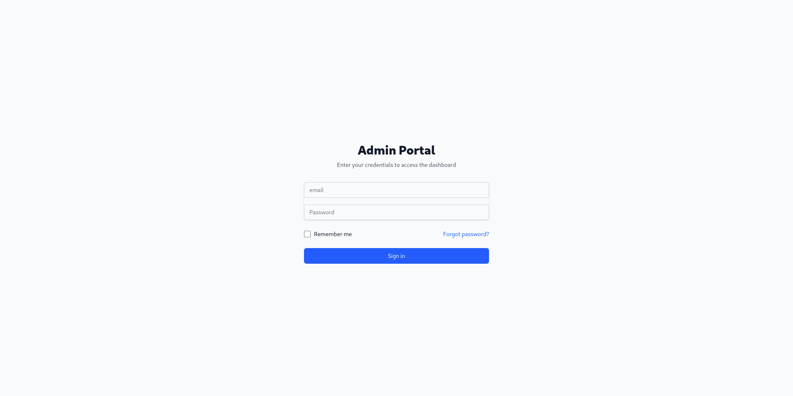
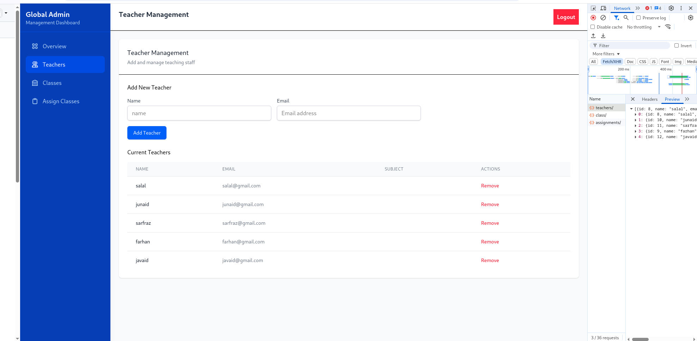
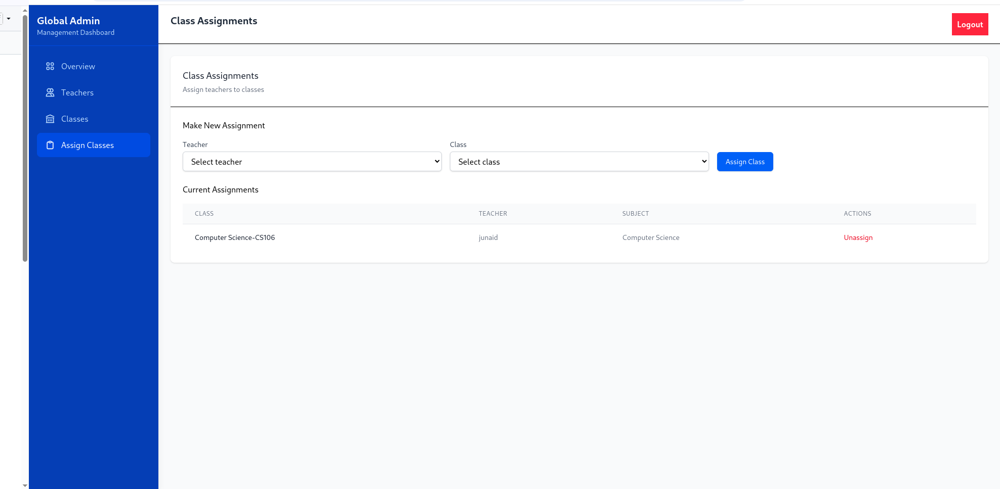
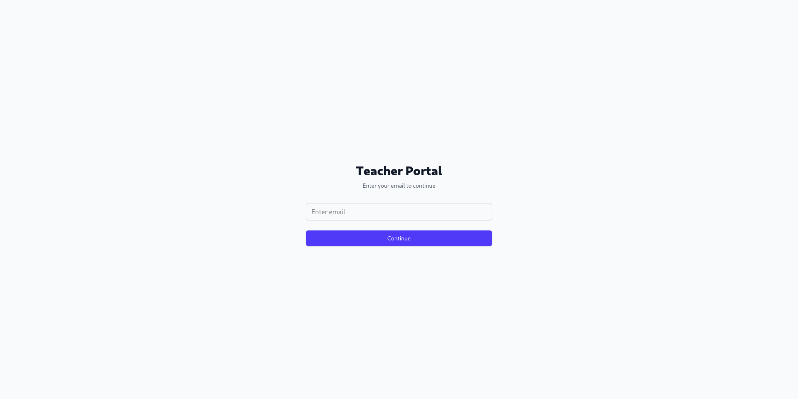
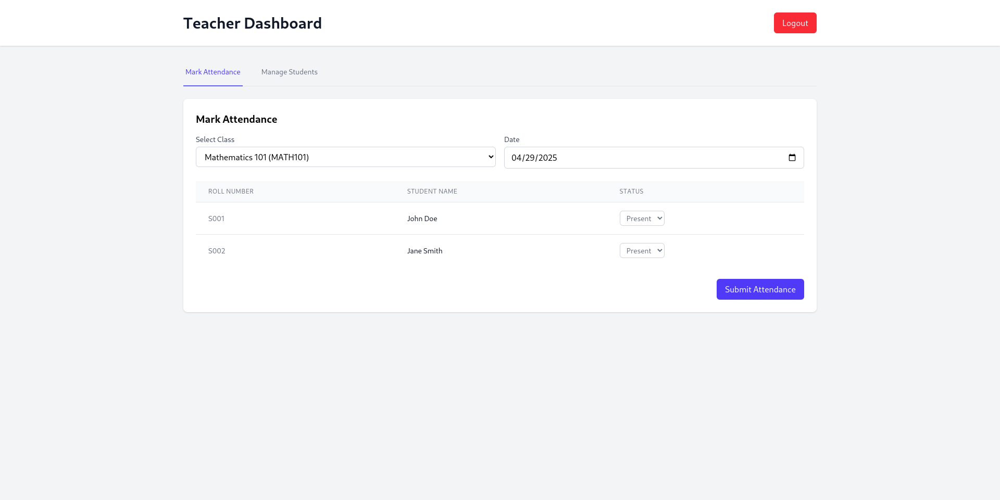

This web-based application efficiently manages teacher authentication, student attendance, and class assignments. The backend is developed using Django and Django REST Framework, ensuring a scalable and secure architecture, with JWT authentication for robust access control. The frontend is built with React and Axios for seamless API interactions, while TailwindCSS enhances the design with modern, responsive styling. PostgreSQL serves as the reliable database solution, providing efficient data management and performance.

Global Admin Login:

Add Teachers:

Assigned Classes To Added Teachers:

login into Teachers Portal:

Teachers Portal To mark Attendance:

